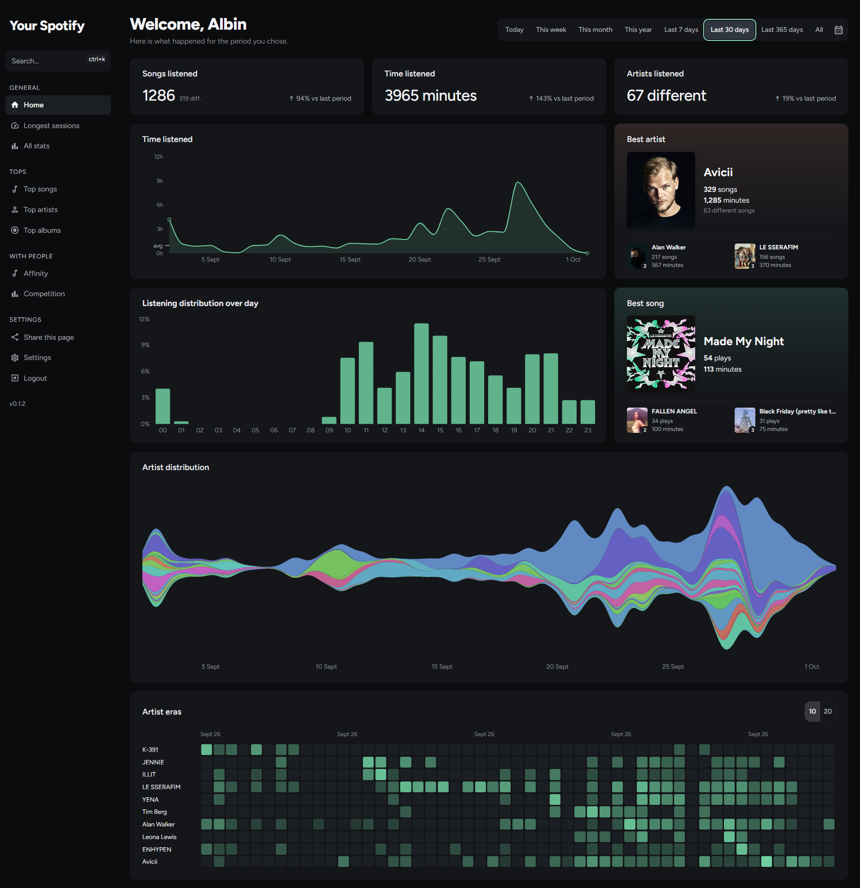
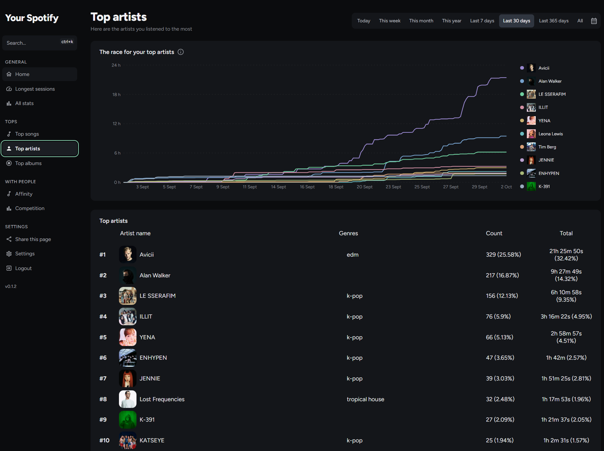
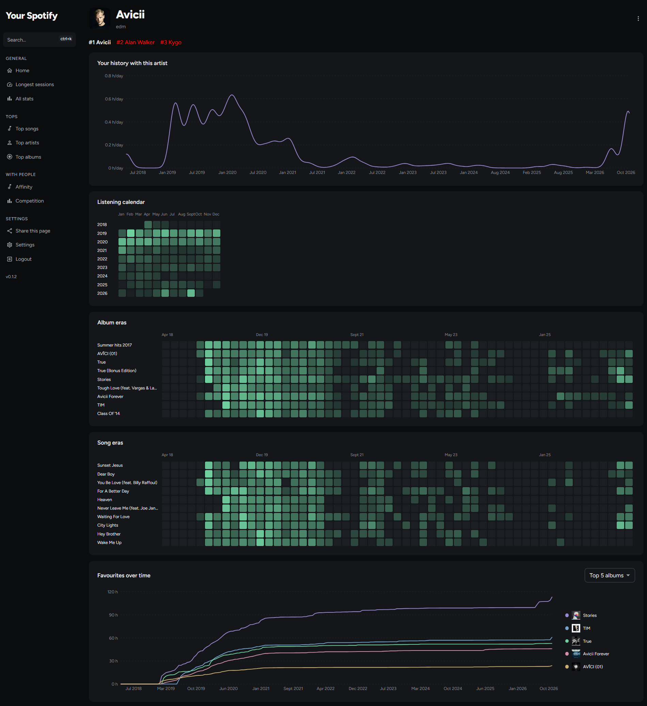
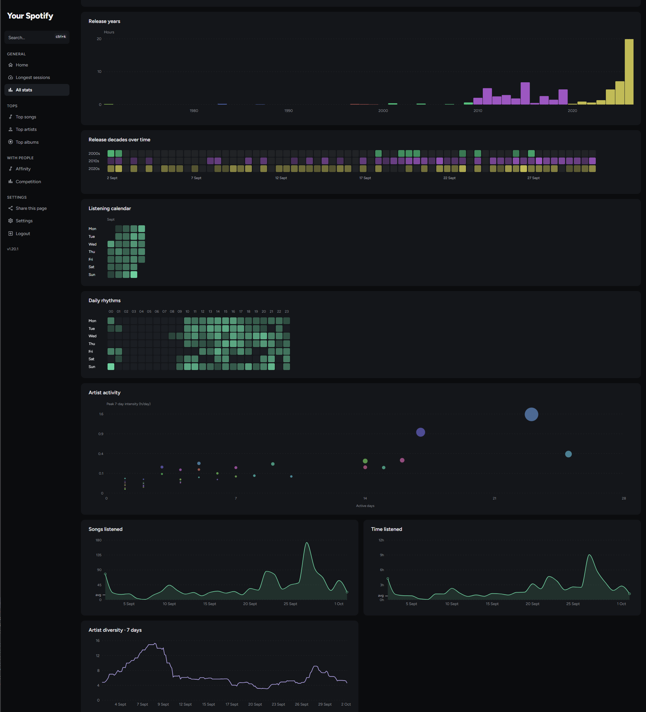

This is my fork of the fanstastic Your Spotify project, complete with an overhaul of the shown statistics, theming, deezer import, and more. Most of the changes, including the rest of this README, have been vibecoded/ written by AI.

Your Spotify is a self-hosted dashboard for your listening history. This fork is
based on [Yooooomi/your_spotify](https://github.com/Yooooomi/your_spotify).

## What's different

- More charts: artist races, listening calendars, artist and album eras,
  listening diversity, and comparisons with friends.
- A softer dark theme, clearer controls and artwork-tinted cards.
- Reworked Spotify imports and support for Deezer history exports.
- Time statistics use reported listening time when available, with full song
  lengths as the fallback.
- Import previews, overlap matching, recording review and optional database backups.
- Artist groups to combine aliases across statistics.

## Run it

Build from this repository to get the fork's changes. Follow the
[setup guide](docs/setup.md) for Docker and Spotify configuration.

More detail: [imports and backups](docs/listening-time-imports.md) ·
[artist groups](docs/artist-groups.md) · [charts](docs/plots-v1.md).

More screenshots

**Top artists** — how your favorites change over a period.

**Artist history** — listening over the years, down to albums and songs.

**All stats** — release years, daily rhythms and listening diversity.

Thanks to the original project's authors and contributors. [License](LICENSE).
For problems with this fork, [open an issue here](https://github.com/albined/your_spotify/issues).
